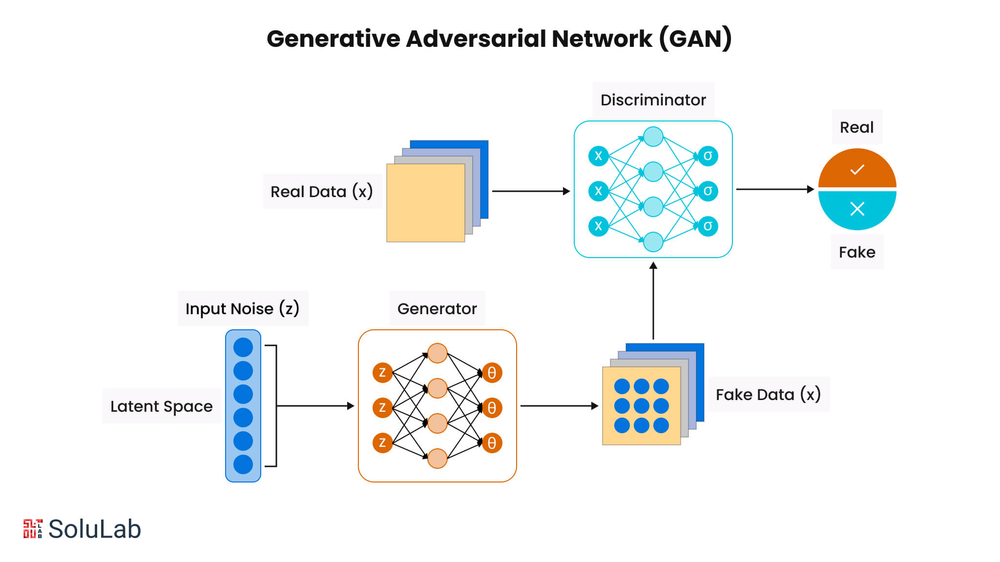
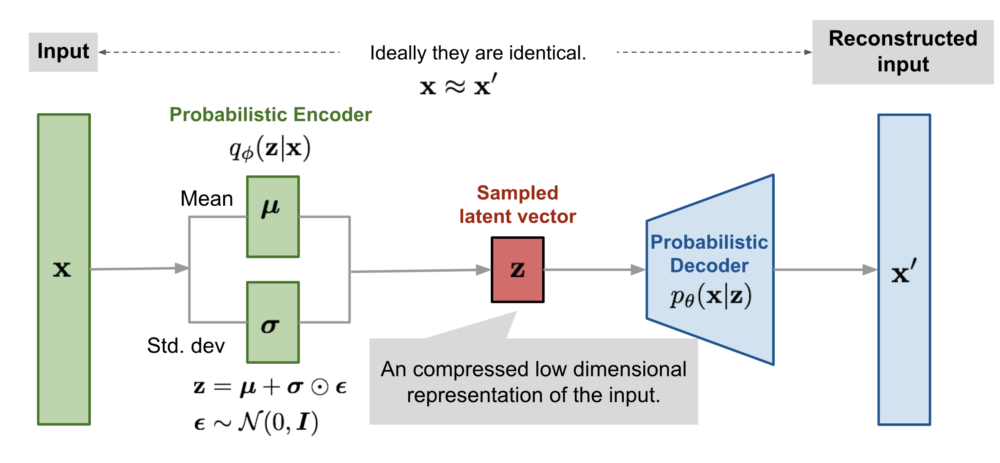

# 🧠 0. Introduction & Motivation

Generative models are a cornerstone of modern machine learning, enabling systems that can *create entirely new data*—images, audio, text—by learning from real-world distributions.

## 🤖 What Are Generative Models?

Three major paradigms have dominated the space:

  

    <ul>
      <li><b>Generative Adversarial Networks (GANs)</b> 
        Introduced by Goodfellow et al. [1], GANs use a game between a generator and a discriminator. 
        ✅ High-quality images 
        ❌ Training instability, no likelihood estimation
      </li>
    </ul>
  

  

    
  

  

    <ul>
      <li><b>Variational Autoencoders (VAEs)</b> 
        Proposed by Kingma and Welling [2], VAEs combine deep learning with probabilistic modeling. 
        ✅ Principled latent space, tractable likelihood 
        ❌ Blurry samples due to Gaussian assumptions
      </li>
    </ul>
  

  

    
  

---

## 🌀 Why Diffusion Models?

Diffusion models offer a compelling alternative with unique advantages:

- **Stability**: No adversarial training  
- **Likelihood-based**: Optimized using a well-defined ELBO objective  
- **Sample quality**: Comparable or superior to GANs  
- **Scalability**: Parallelizable training and flexible conditioning

Originally proposed in Sohl-Dickstein et al. [3], and later improved as Denoising Diffusion Probabilistic Models (DDPM) by Ho et al. [4], diffusion models learn to denoise a sample iteratively from pure noise—essentially learning a reverse stochastic process.

---

## 📈 Real-World Applications

| Domain             | Use Case                                          |
|--------------------|---------------------------------------------------|
| Image generation   | Stable Diffusion, Imagen, DALLE-2 [5][6][7]       |
| Inpainting/editing | Photoshop AI fill, restoration tools              |
| Molecular design   | Protein folding, molecule generation [8]          |
| Medical imaging    | MRI super-resolution, anomaly detection [9][10]   |

These models are reshaping not just AI research, but entire industries.

---

## 📚 References

1. Goodfellow et al., “Generative Adversarial Networks,” NeurIPS 2014.  
2. Kingma & Welling, “Auto-Encoding Variational Bayes,” ICLR 2014.  
3. Sohl-Dickstein et al., “Deep Unsupervised Learning using Nonequilibrium Thermodynamics,” ICML 2015.  
4. Ho et al., “Denoising Diffusion Probabilistic Models,” NeurIPS 2020.  
5. Rombach et al., “High-Resolution Image Synthesis with Latent Diffusion Models,” CVPR 2022.  
6. Saharia et al., “Imagen: Photorealistic Text-to-Image Generation,” ICML 2022.  
7. Ramesh et al., “Hierarchical Text-Conditional Image Generation with CLIP Latents,” arXiv 2022.  
8. Hoogeboom et al., “Equivariant Diffusion for Molecule Generation in 3D,” ICML 2022.  
9. Wolleb et al., “Diffusion Models for Medical Anomaly Detection,” MICCAI 2022.  
10. Pinaya et al., “Brain Imaging Generation with Latent Diffusion Models,” NeuroImage 2022.

