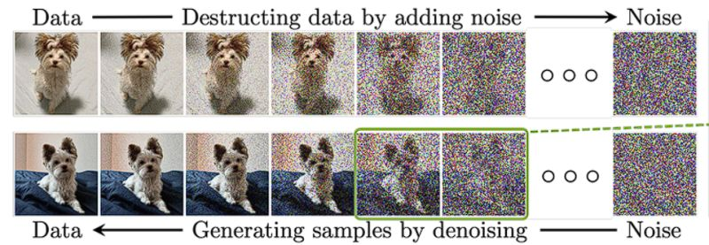
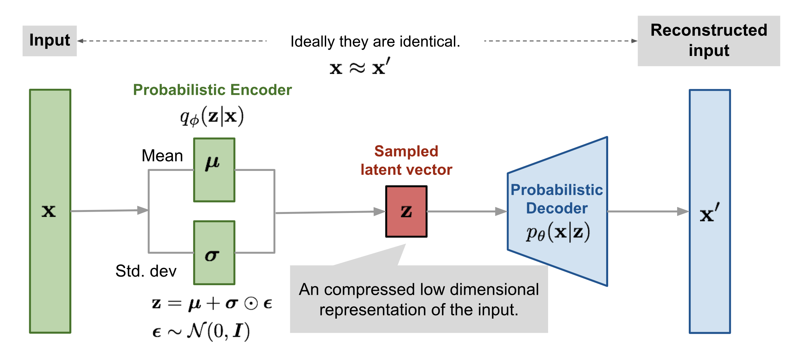
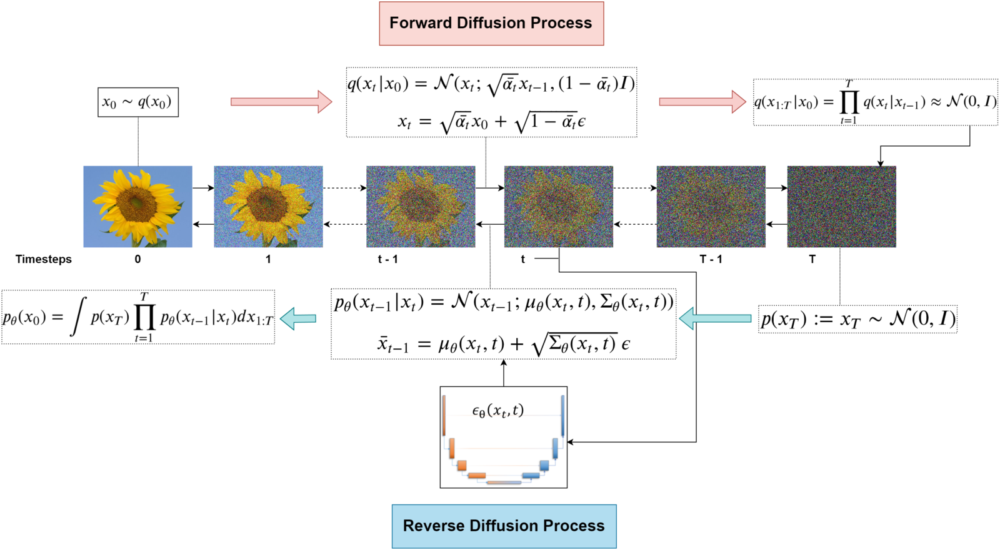

<style>
    .row {
        display: flex;
        flex-direction: row;
        align-items: flex-start;
        gap: 40px;
        margin-bottom: 1em;
    }
    .column {
        flex: 1;
    }
</style>

# ⚙️ 1. Introduction to Diffusion Models

Diffusion Models are generative models that model a target distribution by learning a denoising process at varying noise levels. This concept is inspired by nonequilibrium thermodynamics, in which a physical system starts from a structured, low-entropy state that is gradually “diffused” or driven toward a more disordered, high-entropy equilibrium state over time. In principle, the system can be steered back toward a more ordered configuration, although this typically requires precise control and information about the underlying dynamics. In diffusion-based generative models, we begin with real data and then apply a stochastic “diffusion” of noise step-by-step. Each step slightly corrupts the data by adding Gaussian noise to arrive at a highly noisy, nearly featureless distribution that is mathematically close to a pure Gaussian distribution $\mathcal{N}(\mathbf{0}, \mathbf{I})$.


<div style="margin-top: 20px; text-align: center;">

</div>
Our goal is to understand the mathematics behind this "denoising" magic, starting with a core concept in generative modeling: the ELBO.

### 1.1. The Evidence Lower Bound (ELBO) - A Quick Refresh starting from VAEs 🧐


In many generative models, like VAEs, we want to model the true data distribution $p(x)$.

> The likelihood function tells you:
> How likely it is to observe your data, given some parameter values.
 
Directly maximizing the likelihood $p(x)$ can be tricky. VAEs introduce a latent variable $z$ and aim to maximize $\log p(x)$. This is often intractable, so we maximize a lower bound instead, called the Evidence Lower Bound (ELBO):

Let's start by rewriting the log-likelihood of the data $x$:

$$\log p(x) = \log \int p(x,z) dz = \log \int p(x|z)p(z) dz$$

We introduce an approximate posterior $q(z|x)$ (the "encoder") and $p(x|z)$ becomes our "decoder". The ELBO is derived as:

$$\log p(x) = \log \int p(x,z) \frac{q(z|x)}{q(z|x)} dz = \log \mathbb{E}_{q(z|x)} \left[ \frac{p(x,z)}{q(z|x)} \right]$$

Using Jensen's inequality ($ \log \mathbb{E}[Y] \geq \mathbb{E}[\log Y] $):

$$\log p(x) \geq \mathbb{E}_{q(z|x)} \left[ \log \frac{p(x,z)}{q(z|x)} \right] = \mathbb{E}_{q(z|x)} \left[ \log p(x|z) + \log p(z) - \log q(z|x) \right]$$

This can be rewritten into a more familiar form:

$$\log p(x) \geq \mathbb{E}_{q(z|x)}[\log p(x|z)] - D_{KL}(q(z|x) || p(z))$$

Here:
* $\mathbb{E}_{q(z|x)}[\log p(x|z)]$ is the **reconstruction likelihood**: how well can we reconstruct $x$ from $z$ sampled from our encoder $q(z|x)$?
* $D_{KL}(q(z|x) || p(z))$ is a **Kullback-Leibler (KL) divergence** that acts as a **regularizer**, pushing the distribution of latent codes $q(z|x)$ to be similar to a prior distribution $p(z)$ (often a standard Gaussian).

<!-- Inserted explanation of KL divergence -->
> **What is** $D_{KL}(q(z|x) \| p(z))$?  
> It's defined as:
> $$
> D_{KL}(q(z|x) \| p(z)) = \mathbb{E}_{q(z|x)} \left[ \log \frac{q(z|x)}{p(z)} \right]
> $$
> It measures how much the approximate posterior $q(z|x)$ differs from the prior $p(z)$. It is always non-negative, and equals zero if the two distributions match exactly.

#### Why choose $p(z)$ as a standard Gaussian?
Choosing $p(z)$ as a standard Gaussian $\mathcal{N}(0, I)$ simplifies the KL divergence term and ensures that the latent space is well-regularized. This choice also facilitates the reparameterization trick, which allows us to backpropagate through the sampling process. By reparameterizing $z$ as $z = \mu + \sigma \odot \epsilon$, where $\epsilon \sim \mathcal{N}(0, I)$, we can compute gradients with respect to $\mu$ and $\sigma$ directly, enabling efficient optimization.

### 1.2. ELBO for Sequential Latent Variables (Precursor to Diffusion) 📉


Diffusion models can be seen as a type of latent variable model, but with a sequence of latent variables $x_1, x_2, ..., x_T$.
* $x_0$ is our original clean data.
* $x_1, ..., x_{T-1}$ are increasingly noisy versions of $x_0$.
* $x_T$ is ideally pure noise (e.g., a sample from $\mathcal{N}(0, I)$).

The goal is still to maximize $\log p(x_0)$. We can write a similar ELBO for this sequence:
Let $x_{1:T}$ denote the sequence $x_1, ..., x_T$.
We want to maximize $p(x_0)$. We can express this using the chain of latent states:
$p(x_0) = \int p(x_{0:T}) dx_{1:T}$, where $x_{0:T} = (x_0, x_1, ..., x_T)$.
The ELBO becomes:

$$\log p(x_0) \geq \mathbb{E}_{q(x_{1:T}|x_0)} \left[ \log \frac{p(x_{0:T})}{q(x_{1:T}|x_0)} \right]$$

Here, $q(x_{1:T}|x_0)$ is the (fixed) forward noising process, and $p(x_{0:T})$ is the model we want to learn (the reverse denoising process).

### 1.3. The Two Markov Chains behind Diffusion Models 🔗🔗

Diffusion models are characterized by two key processes:

#### a. Forward Process $q(x_t|x_{t-1})$ (Diffusion Process) ➡️
This process gradually adds Gaussian noise to an image over $T$ timesteps. It's a fixed Markov chain, meaning it's not learned.
It's defined as:

$$q(x_{1:T}|x_0) = \prod_{t=0}^T q(x_t | x_{t-1});$$
$$ q(x_t|x_{t-1}) = \mathcal{N}(x_t; \sqrt{1-\beta_t}x_{t-1}, \beta_t I); $$

Here, $\beta_t$ are small positive constants representing the noise schedule (variance).
Let $\alpha_t = 1-\beta_t$. Then:

$$q(x_t|x_{t-1}) = \mathcal{N}(x_t; \sqrt{\alpha_t}x_{t-1}, (1-\alpha_t)I)$$

A wonderful property of this process is that we can sample $x_t$ directly from $x_0$ at any timestep $t$, without iterating through all intermediate steps. Let $\bar{\alpha}_t = \prod_{i=1}^t \alpha_i$:

$$q(x_t|x_0) = \mathcal{N}(x_t; \sqrt{\bar{\alpha}_t}x_0, (1-\bar{\alpha}_t)I)$$

This means we can get $x_t$ by:

$$x_t = \sqrt{\bar{\alpha}_t}x_0 + \sqrt{1-\bar{\alpha}_t}\epsilon, \quad \text{where } \epsilon \sim \mathcal{N}(0,I)$$

This is super useful for training! We can pick any $x_0$ from our dataset, pick a random $t$, and generate a noisy $x_t$ in one shot.

#### b. Reverse Process $p_{\theta}(x_{t-1}|x_t)$ (Denoising Process) ⬅️
This process learns to reverse the noising steps. It's also a Markov chain, aiming to predict the slightly less noisy $x_{t-1}$ given the noisier $x_t$. This is where our neural network (parameterized by $\theta$) comes in:

$$p_{\theta}(x_{t-1}|x_t) = \mathcal{N}(x_{t-1}; \mu_{\theta}(x_t, t), \Sigma_{\theta}(x_t, t))$$

The goal of training is to make $p_{\theta}(x_{t-1}|x_t)$ a good approximation of the true (but intractable) reverse conditional $q(x_{t-1}|x_t)$.

### 1.4. Decomposing the ELBO for Diffusion Models 🧩

Let's expand the ELBO. The joint probability $p(x_{0:T})$ is given by the reverse process:
$ p(x_{0:T}) = p(x_T) \prod_{t=1}^T p_{\theta}(x_{t-1}|x_t) $
where $p(x_T)$ is a prior, usually $\mathcal{N}(0,I)$.

The forward process $q(x_{1:T}|x_0)$ is given by:
$ q(x_{1:T}|x_0) = \prod_{t=1}^T q(x_t|x_{t-1}) $ (where $x_0$ is given for $q(x_1|x_0)$).

The ELBO can be rewritten and decomposed into several terms (after some algebra!):

$$L_{VLB} = \mathbb{E}_q \left[ \log \frac{p(x_{0:T})}{q(x_{1:T}|x_0)} \right]$$
$$= \mathbb{E}_q \left[ \log \frac{p(x_T) \prod_{t=1}^T p_{\theta}(x_{t-1}|x_t)}{q(x_1|x_0) \prod_{t=2}^T q(x_t|x_{t-1})} \right]$$

A more convenient decomposition for minimization (we minimize $-L_{VLB}$) looks like this:

$$-L_{VLB} = \mathbb{E}_q \left[ -\log p_{\theta}(x_0|x_1) + \sum_{t=2}^T D_{KL}(q(x_{t-1}|x_t, x_0) || p_{\theta}(x_{t-1}|x_t)) + D_{KL}(q(x_T|x_0) || p(x_T)) \right]$$

Let's break down these terms that we want to minimize:
* $L_0 = -\mathbb{E}_q[\log p_{\theta}(x_0|x_1)]$ : This is a reconstruction term. It measures how well the model can reconstruct the original data $x_0$ from the first noisy version $x_1$.
* $L_{t-1} = \mathbb{E}_q[D_{KL}(q(x_{t-1}|x_t, x_0) || p_{\theta}(x_{t-1}|x_t))]$ for $t=2, ..., T$: These are KL divergence terms. They measure the difference between the model's reverse step $p_{\theta}(x_{t-1}|x_t)$ and the true posterior $q(x_{t-1}|x_t, x_0)$ of the forward process. This true posterior tells us what $x_{t-1}$ should look like given $x_t$ *and the original clean image $x_0$*.
* $L_T = D_{KL}(q(x_T|x_0) || p(x_T))$ : This term compares the distribution of the final noised sample $x_T$ (derived from $x_0$) with a prior $p(x_T)$ (e.g., $\mathcal{N}(0,I)$). Since the forward process $q$ is designed such that $q(x_T|x_0)$ is approximately $\mathcal{N}(0,I)$ for large $T$, and $p(x_T)$ is chosen as $\mathcal{N}(0,I)$, this term is often small and doesn't depend on $\theta$, so it's usually ignored during training.

The core of the learning happens in the $L_{t-1}$ terms (and $L_0$, which can be seen as a special case).

#### Why is $p(x_T)$ a normal Gaussian as $T \to \infty$?
As $T$ approaches infinity, the forward noising process $q(x_T|x_0)$ adds so much noise that the original data $x_0$ is completely obliterated. The resulting distribution $q(x_T|x_0)$ converges to a standard Gaussian $\mathcal{N}(0, I)$ due to the central limit theorem and the design of the noise schedule. This ensures that $p(x_T)$, the prior for the reverse process, can also be modeled as $\mathcal{N}(0, I)$, simplifying the training and sampling processes.

#### Step-by-Step Explanation:

**Step 1: Analyze $\bar{\alpha}_t$ as $t \to \infty$:**

Typically, the noise schedule $\{\beta_t\}$ is defined such that:

- Each $\beta_t$ is small and satisfies $0 < \beta_t < 1$.
- As $t \to \infty$, the cumulative product $\bar{\alpha}_t$ approaches zero:

$$
\lim_{t\to\infty}\bar{\alpha}_t = \lim_{t\to\infty}\prod_{i=1}^{t}(1-\beta_i) = 0.
$$


**Step 2: Evaluate mean and covariance of $q(x_t|x_0)$ in this limit:**

Given the distribution:

$$
q(x_t|x_0) = \mathcal{N}\left(x_t;\sqrt{\bar{\alpha}_t}\,x_0,(1-\bar{\alpha}_t)I\right),
$$

- **Mean**: As $\bar{\alpha}_t \to 0$, we have:

$$
\lim_{t\to\infty}\sqrt{\bar{\alpha}_t}\,x_0 = 0.
$$

- **Covariance**: As $\bar{\alpha}_t \to 0$, we have:

$$
\lim_{t\to\infty}(1-\bar{\alpha}_t) = 1.
$$

Thus, clearly:

$$
q(x_t|x_0) \xrightarrow[t\to\infty]{} \mathcal{N}(0, I).
$$

### Final Result:

Therefore, the final limiting behavior is elegantly expressed as:

$$
\boxed{q(x_T|x_0) \xrightarrow[T\to\infty]{} \mathcal{N}(0,I)}
$$

### 1.5. Analyzing the KL Divergence Terms ($L_{t-1}$) 🔎

To minimize $L_{t-1} = D_{KL}(q(x_{t-1}|x_t, x_0) || p_{\theta}(x_{t-1}|x_t))$, we need to characterize $q(x_{t-1}|x_t, x_0)$.
Using Bayes' theorem:

$$q(x_{t-1}|x_t, x_0) = \frac{q(x_t|x_{t-1}, x_0)q(x_{t-1}|x_0)}{q(x_t|x_0)}$$

Since the forward process is Markovian, $q(x_t|x_{t-1}, x_0) = q(x_t|x_{t-1})$.
We know $q(x_t|x_{t-1})$, $q(x_{t-1}|x_0)$, and $q(x_t|x_0)$ are all Gaussians. After some lovely math involving products of Gaussian PDFs and completing the square, we find that $q(x_{t-1}|x_t, x_0)$ is also a Gaussian:

$$q(x_{t-1}|x_t, x_0) = \mathcal{N}(x_{t-1}; \tilde{\mu}_t(x_t, x_0), \tilde{\beta}_t I)$$

Where the mean $\tilde{\mu}_t(x_t, x_0)$ and variance $\tilde{\beta}_t I$ are:

$$\tilde{\mu}_t(x_t, x_0) = \frac{\sqrt{\bar{\alpha}_{t-1}}\beta_t}{1-\bar{\alpha}_t}x_0 + \frac{\sqrt{\alpha_t}(1-\bar{\alpha}_{t-1})}{1-\bar{\alpha}_t}x_t$$
$$\tilde{\beta}_t = \frac{1-\bar{\alpha}_{t-1}}{1-\bar{\alpha}_t}\beta_t$$

Our model's reverse step is $p_{\theta}(x_{t-1}|x_t) = \mathcal{N}(x_{t-1}; \mu_{\theta}(x_t,t), \sigma_t^2 I)$.
The KL divergence between two Gaussians $\mathcal{N}(\mu_1, \sigma_1^2 I)$ and $\mathcal{N}(\mu_2, \sigma_2^2 I)$ simplifies nicely. If we fix the variance of our model $\sigma_t^2$ (e.g., set $\sigma_t^2 = \tilde{\beta}_t$ or $\sigma_t^2 = \beta_t$, as is common), the KL divergence term $L_{t-1}$ becomes proportional to the squared difference between the means:

$$L_{t-1} \propto \mathbb{E}_{x_0, \epsilon \text{ (to get } x_t)} \left[ \frac{1}{2\sigma_t^2} || \tilde{\mu}_t(x_t, x_0) - \mu_{\theta}(x_t, t) ||^2 \right]$$

So, we need our neural network $\mu_{\theta}(x_t, t)$ to predict $\tilde{\mu}_t(x_t, x_0)$.

### 1.6. Parameterizing the Mean $\mu_{\theta}(x_t, t)$ with Noise Prediction 🎯

This is where the magic simplification happens!
The mean $\tilde{\mu}_t(x_t, x_0)$ depends on $x_0$, which is not available during the reverse (generation) process. However, during training, we *do* have $x_0$.
Recall the forward sampling equation: $x_t = \sqrt{\bar{\alpha}_t}x_0 + \sqrt{1-\bar{\alpha}_t}\epsilon$. We can re-arrange this to express $x_0$ in terms of $x_t$ and the noise $\epsilon$:

$$x_0 = \frac{x_t - \sqrt{1-\bar{\alpha}_t}\epsilon}{\sqrt{\bar{\alpha}_t}}$$

Now, substitute this expression for $x_0$ back into the equation for $\tilde{\mu}_t(x_t, x_0)$. After some algebraic simplification, $\tilde{\mu}_t$ can be re-written as:

$$\tilde{\mu}_t(x_t, \epsilon) = \frac{1}{\sqrt{\alpha_t}}\left(x_t - \frac{\beta_t}{\sqrt{1-\bar{\alpha}_t}}\epsilon\right) = \frac{1}{\sqrt{\alpha_t}}\left(x_t - \frac{1-\alpha_t}{\sqrt{1-\bar{\alpha}_t}}\epsilon\right)$$

Instead of making our neural network $\mu_{\theta}(x_t, t)$ directly predict this complex mean, we parameterize it to predict the noise $\epsilon$ that was added at step $t$. Let $\epsilon_{\theta}(x_t, t)$ be the noise predicted by our neural network (usually a U-Net architecture).
We define our model's mean as:

$$\mu_{\theta}(x_t, t) = \frac{1}{\sqrt{\alpha_t}}\left(x_t - \frac{\beta_t}{\sqrt{1-\bar{\alpha}_t}}\epsilon_{\theta}(x_t, t)\right)$$
**This is a key implementation point!** Our network learns to predict noise.

Now, the squared difference term in $L_{t-1}$ becomes:
$$|| \tilde{\mu}_t(x_t, \epsilon) - \mu_{\theta}(x_t, t) ||^2 = \left|\left| \frac{1}{\sqrt{\alpha_t}}\left(x_t - \frac{\beta_t}{\sqrt{1-\bar{\alpha}_t}}\epsilon\right) - \frac{1}{\sqrt{\alpha_t}}\left(x_t - \frac{\beta_t}{\sqrt{1-\bar{\alpha}_t}}\epsilon_{\theta}(x_t, t)\right) \right|\right|^2$$
$$= \left|\left| \frac{1}{\sqrt{\alpha_t}} \frac{\beta_t}{\sqrt{1-\bar{\alpha}_t}} (\epsilon_{\theta}(x_t, t) - \epsilon) \right|\right|^2 = \frac{\beta_t^2}{\alpha_t(1-\bar{\alpha}_t)} ||\epsilon - \epsilon_{\theta}(x_t,t)||^2$$

So, the loss term $L_{t-1}$ (for $t \geq 2$) becomes:

$$L_{t-1} = \mathbb{E}_{x_0, \epsilon} \left[ \frac{1}{2\sigma_t^2} \frac{\beta_t^2}{\alpha_t(1-\bar{\alpha}_t)} ||\epsilon - \epsilon_{\theta}(\sqrt{\bar{\alpha}_t}x_0 + \sqrt{1-\bar{\alpha}_t}\epsilon, t)||^2 \right]$$
The $L_0$ term (reconstruction) can also be formulated in a similar way or handled by this noise prediction framework at $t=1$.

### 1.7. The Simplified Loss Function (The Big Reveal! 🎉)

The full ELBO contains these weighted noise prediction terms. However, Ho et al. (2020) in their paper "Denoising Diffusion Probabilistic Models" (DDPM) found that a much simpler, unweighted version of this loss works remarkably well in practice.
They propose to train the model by minimizing the following simple mean squared error between the true noise and the predicted noise:

$$L_{simple}(\theta) = \mathbb{E}_{t \sim U(1,T), x_0 \sim p_{data}, \epsilon \sim \mathcal{N}(0,I)} \left[ ||\epsilon - \epsilon_{\theta}(\sqrt{\bar{\alpha}_t}x_0 + \sqrt{1-\bar{\alpha}_t}\epsilon, t)||^2 \right]$$

**This is it!** This is the objective function that most diffusion models are trained on.
We simply:
1.  Pick a random training image $x_0$.
2.  Pick a random timestep $t$.
3.  Sample a random noise vector $\epsilon$.
4.  Create the noised image $x_t = \sqrt{\bar{\alpha}_t}x_0 + \sqrt{1-\bar{\alpha}_t}\epsilon$.
5.  Feed $x_t$ and $t$ to our neural network $\epsilon_{\theta}(x_t, t)$.
6.  Ask the network to predict the original noise $\epsilon$ that was added.
7.  The loss is just the Mean Squared Error between the true $\epsilon$ and the predicted $\epsilon_{\theta}$.

It's beautifully simple and incredibly effective.

### 1.8. Why this Simplification Works and Implementation Details 🛠️

* **Why simplify?** The weighting factors $\frac{\beta_t^2}{2\sigma_t^2 \alpha_t (1-\bar{\alpha}_t)}$ can be complex to tune, and empirically, the unweighted version performs very well and is more stable. It effectively re-weights the importance of different timesteps.
* **Choice of $\sigma_t^2$**: The variance of the reverse process $p_{\theta}(x_{t-1}|x_t)$ is often set to $\sigma_t^2 = \tilde{\beta}_t = \frac{1-\bar{\alpha}_{t-1}}{1-\bar{\alpha}_t}\beta_t$ or $\sigma_t^2 = \beta_t$. The DDPM paper found that both choices work well.

### 1.9. Deriving the Reverse Sampling Formula

Let's derive the formula for sampling during the reverse process step-by-step:

1. First, recall that the true posterior for the reverse process is:

   $q(\mathbf{x}_{t-1} \mid \mathbf{x}_t, \mathbf{x}_0) = \mathcal{N}(\mathbf{x}_{t-1}; \tilde{\mu}_t(\mathbf{x}_t, \mathbf{x}_0), \tilde{\beta}_t \mathbf{I})$

2. Where the mean $\tilde{\mu}_t$ can be derived using Bayes' rule:

   $\tilde{\mu}_t(\mathbf{x}_t, \mathbf{x}_0) = \frac{\sqrt{\alpha_t}(1-\bar{\alpha}_{t-1})}{1-\bar{\alpha}_t}\mathbf{x}_t + \frac{\sqrt{\bar{\alpha}_{t-1}}\beta_t}{1-\bar{\alpha}_t}\mathbf{x}_0$

3. We can't use this directly in practice, since we don't know the true $\mathbf{x}_0$ during sampling. However, given our noise prediction network, we can estimate $\mathbf{x}_0$ from $\mathbf{x}_t$:

   $\mathbf{x}_0 \approx \hat{\mathbf{x}}_0 = \frac{1}{\sqrt{\bar{\alpha}_t}}(\mathbf{x}_t - \sqrt{1-\bar{\alpha}_t}\boldsymbol{\epsilon}_\theta(\mathbf{x}_t, t))$

4. Substituting this estimate into the formula for $\tilde{\mu}_t$, and after algebraic simplification, we get the DDPM sampling equation:

   $\mathbf{x}_{t-1} = \frac{1}{\sqrt{\alpha_t}} \left( \mathbf{x}_t - \frac{\beta_t}{\sqrt{1 - \bar{\alpha}_t}} \boldsymbol{\epsilon}_\theta(\mathbf{x}_t, t) \right) + \sigma_t \mathbf{z}, \quad \mathbf{z} \sim \mathcal{N}(0, \mathbf{I})$

   Where $\sigma_t^2 = \tilde{\beta}_t = \frac{1-\bar{\alpha}_{t-1}}{1-\bar{\alpha}_t}\beta_t$ is the variance term from the true posterior.

This formula is the heart of the DDPM sampling process. Notice how:
- The first term denoises the noisy sample using our predicted noise
- The second term adds a controlled amount of new noise to maintain the stochastic nature of the process

When we apply this formula step by step from t=T down to t=1, we gradually transform random noise into a coherent data sample.

### 📉 Beta Schedules: Designing the Noise Trajectory

The choice of noise schedule $\{\beta_1, \beta_2, ..., \beta_T\}$ significantly impacts sample quality and training dynamics:

* **Linear schedule**: A simple linear increase from 0.0001 to 0.02 (original DDPM paper)
  * $\beta_t$ increases linearly from $\beta_1$ to $\beta_T$
  * Easy to implement but not optimal for all data types

* **Cosine schedule**: A smoother, more natural decay proposed by Nichol & Dhariwal
  * Uses cosine function to create a schedule that adds noise more gradually at first
  * Better preserves data structure in early timesteps
  * Improves sample quality

* **Learned schedule**: The $\beta_t$ values are optimized jointly with model weights
  * More complex but can adapt to specific data characteristics
  * Requires additional training complexity

The optimal schedule balances between preserving low-frequency information early in the diffusion process and adding sufficient noise to cover the data distribution.

---
### 1.10. Implementation Details 👨‍💻
#### Pseudo-code for Training
```python
# Training Algorithm
for each training step:
    x_0 = sample_from_data()  # Original image
    t = random_timestep(1, T)  # Random timestep
    epsilon = sample_noise()  # Noise ~ N(0, I)

    # Generate noised image
    x_t = sqrt(alpha_bar[t]) * x_0 + sqrt(1 - alpha_bar[t]) * epsilon

    # Predict noise using the model
    epsilon_pred = model(x_t, t)

    # Compute loss
    loss = mse_loss(epsilon, epsilon_pred)

    # Update model parameters
    optimizer.step(loss)
```

#### Pseudo-code for Sampling
```python
# Sampling Algorithm
x_T = sample_noise()  # Start with pure noise

for t in range(T, 0, -1):
    epsilon_pred = model(x_t, t)  # Predict noise
    mu_t = (1 / sqrt(alpha[t])) * (x_t - beta[t] / sqrt(1 - alpha_bar[t]) * epsilon_pred)

    if t > 1:
        z = sample_noise()  # Add noise for intermediate steps
    else:
        z = 0  # No noise at the last step

    x_t_minus_1 = mu_t + sigma[t] * z

x_0 = x_t_minus_1  # Final generated image
```

### References
1. Ho, J., Jain, A., & Abbeel, P. (2020). "Denoising Diffusion Probabilistic Models." arXiv preprint arXiv:2006.11239.
2. Kingma, D. P., & Welling, M. (2013). "Auto-Encoding Variational Bayes." arXiv preprint arXiv:1312.6114.
3. Sohl-Dickstein, J., Weiss, E., Maheswaranathan, N., & Ganguli, S. (2015). "Deep Unsupervised Learning using Nonequilibrium Thermodynamics." arXiv preprint arXiv:1503.03585.
