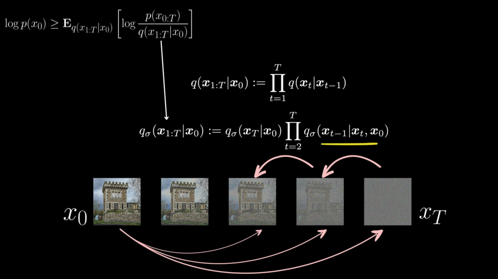
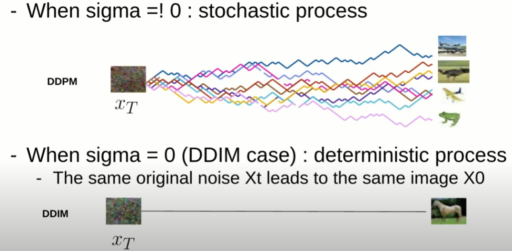

<style>
    .row {
        display: flex;
        flex-direction: row;
        align-items: flex-start;
        gap: 40px;
        margin-bottom: 1em;
    }
    .column {
        flex: 1;
    }
</style>

# 🚀 2. Denoising Diffusion Implicit Models (DDIM)

While Denoising Diffusion Probabilistic Models (DDPMs) have shown remarkable success in generating high-fidelity samples, they typically require many sampling steps (e.g., $T=1000$ or more) due to their stochastic nature, making generation slow. Denoising Diffusion Implicit Models (DDIMs), introduced by Song, Meng, and Ermon (2020), offer a significant improvement by formulating a non-Markovian generative process that allows for much faster sampling with comparable or even better sample quality.

A key insight of DDIM is that the DDPM objective function does not strictly depend on the Markovian nature of the forward noising process. This allows DDIM to use the *same trained DDPM model* but employ a different, more flexible sampling procedure.

<div style="margin-top: 20px; text-align: center;">
    
    <p style="font-size:0.9em; color:gray;">Credits: https://www.youtube.com/watch?v=n2P6EMbN0pc&t=805s</p>
</div>

### 2.1. From DDPM to DDIM: The Core Idea 💡

Recall that DDPMs define a forward process $q(x_t|x_{t-1})$ and learn to approximate the reverse process $p_{\theta}(x_{t-1}|x_t)$. The DDPM objective (simplified loss) is:

$$L_{simple}(\theta) = \mathbb{E}_{t, x_0, \epsilon} \left[ ||\epsilon - \epsilon_{\theta}(\sqrt{\bar{\alpha}_t}x_0 + \sqrt{1-\bar{\alpha}_t}\epsilon, t)||^2 \right]$$

This objective only depends on the marginal $q(x_t|x_0) = \mathcal{N}(x_t; \sqrt{\bar{\alpha}_t}x_0, (1-\bar{\alpha}_t)I)$. It does not explicitly depend on the step-by-step Markovian structure of $q(x_t|x_{t-1})$.

### Let's understand why:
Recall the KL divergence term in the DDPM objective:
$$
\mathbb{D}_{KL}(q(x_{t-1}|x_t, x_0) || p_{\theta}(x_{t-1}|x_t)) = \frac{1}{2\sigma_t^2} \frac{\beta_t^2}{\alpha_t(1-\bar{\alpha}_t)} ||\epsilon - \epsilon_{\theta}(\sqrt{\bar{\alpha}_t}x_0 + \sqrt{1-\bar{\alpha}_t}\epsilon, t)||^2
$$
in which the forward process $q(x_{t-1}|x_t, x_0)$ is defined as:
$$q(x_{t-1}|x_t, x_0) = \mathcal{N}(x_{t-1}; \tilde{\mu}_t(x_t, x_0), \tilde{\beta}_t I)$$

Where the mean $\tilde{\mu}_t(x_t, x_0)$ and variance $\tilde{\beta}_t I$ are:

$$ \tilde{\mu}_t(x_t, x_0) = \tilde{\mu}_t(x_t, \epsilon) = \frac{1}{\sqrt{\alpha_t}}\left(x_t - \frac{1-\alpha_t}{\sqrt{1-\bar{\alpha}_t}}\epsilon\right)$$
$$\tilde{\beta}_t = \frac{1-\bar{\alpha}_{t-1}}{1-\bar{\alpha}_t}\beta_t$$

and the reverse process $p_{\theta}(x_{t-1}|x_t)$ is defined as:
$$p_{\theta}(x_{t-1}|x_t) = \mathcal{N}(x_{t-1}; \mu_{\theta}(x_t, t), \sigma_t^2 I)$$
where $\mu_{\theta}(x_t, t)$ is the learned mean and $\sigma_t^2$ is a fixed variance.

Let's define a more general forward process in terms of matrices $A_t$ and $B_t$:
$$q(x_{t-1}|x_t, x_0) = \mathcal{N}(x_{t-1}; \mu_q = A_t x_t + B_t \epsilon, \sigma_q = \tilde{\sigma}^2_{t} I)$$
where $A_t$ and $B_t$ are matrices that can be learned or defined.

and at the same way a more general reverse process:
$$p_{\theta}(x_{t-1}|x_t) = \mathcal{N}(x_{t-1}; \mu_\theta = A_t x_t + B_t \epsilon_\theta, \sigma_\theta = \tilde{\sigma}^2_{t} I).$$

The KL term in this case becomes:
$$
\mathbb{D}_{KL}(q(x_{t-1}|x_t, x_0) || p_{\theta}(x_{t-1}|x_t)) = \frac{1}{2\tilde{\sigma}^2_{t}} ||(A_t x_t + B_t \epsilon_\theta) - (A_t x_t - B_t \epsilon)||^2
$$
$$
=  \frac{1}{2\tilde{\sigma}^2_{t}} B_t ||\epsilon_\theta - \epsilon||^2.
$$

And since in many DDPM implementations ignore the variance term, we can see that the objective function is not strictly dependent on the Markovian nature of the forward process. The DDPM objective can be optimized with respect to any forward process $q(x_t|x_0)$ that has the same marginal distribution as the original DDPM.

DDIM leverages this by proposing a class of non-Markovian forward processes that share the same marginals $q(x_t|x_0)$ but lead to a different generative process. The remarkable part is that the same $\epsilon_{\theta}(x_t, t)$ network trained for DDPM can be used.

### 2.2. DDIM Forward Process: Non-Markovian Sampling 🚀
The author of DDIMs propose the following Non-Markovian forward process:
$$
q_\sigma(x_{1:T}|x_0) = q_\sigma(x_T|x_0)\prod_{t=1}^T q_\sigma(x_{t-1}|x_t, x_0)
$$
with this new kernel definition:
$$
q_\sigma(x_{t-1}|x_t, x_0) = \mathcal{N}\left(\sqrt{\bar{\alpha}_{t-1}}x_0 + \sqrt{1-\bar{\alpha}_{t-1} - \sigma^2_t} \cdot \frac{x_t - \sqrt{\bar{\alpha}_t}x_0}{\sqrt{1 - \bar{\alpha}_t}}, \sigma^2_t I\right)
$$
$$
= \mathcal{N}(x_{t-1}; \mu_q = A_t x_t + B_t x_0, \sigma_q = \tilde{\sigma}^2_{t} I)
$$

As discussed in Sec. 2.1 if we can prove that:
 
$$
q_\sigma(x_{t-1}|x_0) = \mathcal{N}(\sqrt{\bar{\alpha}_t}x_0, (1-\bar{\alpha}_t)I); \forall t \in \mathbb{N}
$$
 
we don't need to train a different model and we can reuse the DDPM one.


<details>
    <summary> <h2>Mathematical Proof 🧮 </h2></summary>

Okay, let's detail the proof. The core of this demonstration is to show that the marginal distribution $q_\sigma(x_k|x_0)$ for any timestep $k$ in the DDIM non-Markovian forward process has the same form as in the original DDPM formulation. This is key to why a DDPM-trained model can be used with DDIM. We will use a proof by induction, working backward from timestep $T$.
#### Recall: Gaussian Marginalization Rule

Before diving into the proof, let's state the Gaussian marginalization rule that we will use.
If we have two random variables $x$ and $y$ such that:
1.  The distribution of $x$ is Gaussian:
    $p(x) = \mathcal{N}(x | \mu_x, \Sigma_x)$
2.  The conditional distribution of $y$ given $x$ is also Gaussian and linear in $x$:
    $p(y|x) = \mathcal{N}(y | Ax + b, \Sigma_y)$

Then, the marginal distribution of $y$, denoted $p(y)$, is also Gaussian and is given by:
$$p(y) = \mathcal{N}(y | A\mu_x + b, \Sigma_y + A\Sigma_x A^T)$$

In our context, for the inductive step:
* $x$ will represent $x_t$ (the state at timestep $t$).
* $y$ will represent $x_{t-1}$ (the state at timestep $t-1$).
* $p(x)$ will be $q_\sigma(x_t|x_0)$.
* $p(y|x)$ will be the DDIM kernel $q_\sigma(x_{t-1}|x_t, x_0)$.
* $p(y)$ will be the target marginal $q_\sigma(x_{t-1}|x_0)$.

#### Proof by Induction

We want to prove the following statement $P(k)$ for all $k \in \{0, 1, \dots, T\}$:
**$P(k): q_\sigma(x_k|x_0) = \mathcal{N}(x_k; \sqrt{\bar{\alpha}_k}x_0, (1-\bar{\alpha}_k)I)$**

This states that the distribution of the noisy sample $x_k$ given the original data $x_0$ is a Gaussian with mean $\sqrt{\bar{\alpha}_k}x_0$ and covariance $(1-\bar{\alpha}_k)I$.

#### 1. Base Case:
Let's consider the timestep $k=T$. The DDIM forward process $q_\sigma(x_{1:T}|x_0) = q_\sigma(x_T|x_0)\prod_{t=1}^T q_\sigma(x_{t-1}|x_t, x_0)$ starts with $q_\sigma(x_T|x_0)$. It is defined to match the DDPM marginal at the final timestep $T$:
$$q_\sigma(x_T|x_0) = \mathcal{N}(x_T; \sqrt{\bar{\alpha}_T}x_0, (1-\bar{\alpha}_T)I)$$
Thus, $P(T)$ holds.

#### 2. Inductive Hypothesis:
Assume that $P(t)$ is true for some timestep $t$, where $1 \le t \le T$. This means:
$$q_\sigma(x_t|x_0) = \mathcal{N}(x_t; \sqrt{\bar{\alpha}_t}x_0, (1-\bar{\alpha}_t)I)$$
In terms of our Gaussian marginalization rule ($p(x) = \mathcal{N}(x | \mu_x, \Sigma_x)$):
* $\mu_x = \sqrt{\bar{\alpha}_t}x_0$
* $\Sigma_x = (1-\bar{\alpha}_t)I$

#### 3. Inductive Step:
We need to show that $P(t-1)$ is true, i.e., $q_\sigma(x_{t-1}|x_0) = \mathcal{N}(x_{t-1}; \sqrt{\bar{\alpha}_{t-1}}x_0, (1-\bar{\alpha}_{t-1})I)$.

We use the DDIM non-Markovian kernel $q_\sigma(x_{t-1}|x_t, x_0)$:
$$q_\sigma(x_{t-1}|x_t, x_0) = \mathcal{N}\left(x_{t-1}; \sqrt{\bar{\alpha}_{t-1}}x_0 + \sqrt{1-\bar{\alpha}_{t-1} - \sigma^2_t} \cdot \frac{x_t - \sqrt{\bar{\alpha}_t}x_0}{\sqrt{1 - \bar{\alpha}_t}}, \sigma^2_t I\right)$$
Let's identify $A$, $b$, and $\Sigma_y$ from this kernel for our $p(y|x) = \mathcal{N}(y | Ax + b, \Sigma_y)$ form, where $y=x_{t-1}$ and $x=x_t$.
The mean is:
$\left(\frac{\sqrt{1-\bar{\alpha}_{t-1} - \sigma^2_t}}{\sqrt{1 - \bar{\alpha}_t}}\right)x_t + \left(\sqrt{\bar{\alpha}_{t-1}}x_0 - \frac{\sqrt{1-\bar{\alpha}_{t-1} - \sigma^2_t}\sqrt{\bar{\alpha}_t}x_0}{\sqrt{1 - \bar{\alpha}_t}}\right)$
So:
* $A = \frac{\sqrt{1-\bar{\alpha}_{t-1} - \sigma^2_t}}{\sqrt{1 - \bar{\alpha}_t}}I$
* $b = \left(\sqrt{\bar{\alpha}_{t-1}} - \frac{\sqrt{1-\bar{\alpha}_{t-1} - \sigma^2_t}\sqrt{\bar{\alpha}_t}}{\sqrt{1 - \bar{\alpha}_t}}\right)x_0$
* $\Sigma_y = \sigma^2_t I$

Now, we apply the Gaussian marginalization rule to find $q_\sigma(x_{t-1}|x_0)$.

#### Mean of $q_\sigma(x_{t-1}|x_0)$: $A\mu_x + b$
$$\text{Mean} = \left(\frac{\sqrt{1-\bar{\alpha}_{t-1} - \sigma^2_t}}{\sqrt{1 - \bar{\alpha}_t}}I\right)(\sqrt{\bar{\alpha}_t}x_0) + \left(\sqrt{\bar{\alpha}_{t-1}} - \frac{\sqrt{1-\bar{\alpha}_{t-1} - \sigma^2_t}\sqrt{\bar{\alpha}_t}}{\sqrt{1 - \bar{\alpha}_t}}\right)x_0$$
$$= \left( \frac{\sqrt{1-\bar{\alpha}_{t-1} - \sigma^2_t}\sqrt{\bar{\alpha}_t}}{\sqrt{1 - \bar{\alpha}_t}} + \sqrt{\bar{\alpha}_{t-1}} - \frac{\sqrt{1-\bar{\alpha}_{t-1} - \sigma^2_t}\sqrt{\bar{\alpha}_t}}{\sqrt{1 - \bar{\alpha}_t}} \right) x_0$$
The two terms with fractions cancel out:
$$\text{Mean} = \sqrt{\bar{\alpha}_{t-1}}x_0$$
This matches the mean required for $P(t-1)$.

#### Covariance of $q_\sigma(x_{t-1}|x_0)$: $\Sigma_y + A\Sigma_x A^T$
$$\text{Covariance} = \sigma^2_t I + \left(\frac{\sqrt{1-\bar{\alpha}_{t-1} - \sigma^2_t}}{\sqrt{1 - \bar{\alpha}_t}}I\right) ((1-\bar{\alpha}_t)I) \left(\frac{\sqrt{1-\bar{\alpha}_{t-1} - \sigma^2_t}}{\sqrt{1 - \bar{\alpha}_t}}I\right)^T$$
Since $I^T = I$:
$$= \sigma^2_t I + \frac{(1-\bar{\alpha}_{t-1} - \sigma^2_t)}{(1 - \bar{\alpha}_t)} (1-\bar{\alpha}_t) I \cdot I \cdot I$$
$$= \sigma^2_t I + (1-\bar{\alpha}_{t-1} - \sigma^2_t)I$$
$$= (\sigma^2_t + 1-\bar{\alpha}_{t-1} - \sigma^2_t)I$$
$$\text{Covariance} = (1-\bar{\alpha}_{t-1})I$$
This matches the covariance required for $P(t-1)$.

Therefore, we have shown that if $P(t)$ is true, then $P(t-1)$ is also true:
$$q_\sigma(x_{t-1}|x_0) = \mathcal{N}(x_{t-1}; \sqrt{\bar{\alpha}_{t-1}}x_0, (1-\bar{\alpha}_{t-1})I)$$

#### 4. Conclusion of Induction:
Since the base case $P(T)$ holds, and we have shown that $P(t) \implies P(t-1)$ for $1 \le t \le T$, by the principle of mathematical induction (working backwards from $T$ down to $0$), the statement $P(k)$ is true for all $k \in \{0, 1, \dots, T\}$.

This means that for any timestep $k$, including $t-1$ as shown in the user's provided text and image, the marginal distribution $q_\sigma(x_k|x_0)$ under the DDIM non-Markovian process is indeed $\mathcal{N}(x_k; \sqrt{\bar{\alpha}_k}x_0, (1-\bar{\alpha}_k)I)$. This is the same form as the marginals in the original DDPM, which is why the same trained $\epsilon_\theta$ network can be used for DDIM sampling. The objective function only depends on these marginals, not the specific step-by-step structure of the forward process.
</details>

### 2.3. The DDIM Generative Process 🔄

The DDIM forward process impose a generative process (reverse process) that is a specific instance of a more general family. Instead of the DDPM sampling step:

$$x_{t-1} = \frac{1}{\sqrt{\alpha_t}} \left( x_t - \frac{1-\alpha_t}{\sqrt{1 - \bar{\alpha}_t}} \boldsymbol{\epsilon}_\theta(x_t, t) \right) + \sigma_t \epsilon_t$$
where $\sigma_t^2 = \tilde{\beta}_t = \frac{1-\bar{\alpha}_{t-1}}{1-\bar{\alpha}_t}\beta_t$ for DDPMs.

DDIM introduces a more general sampling step. The key is how $x_{t-1}$ is constructed from $x_t$ and the predicted noise $\boldsymbol{\epsilon}_\theta(x_t, t)$.

Starting from the DDIM kernels:
$$
q_\sigma(x_{t-1}|x_t, x_0) = \mathcal{N}\left(\sqrt{\bar{\alpha}_{t-1}}x_0 + \sqrt{1-\bar{\alpha}_{t-1} - \sigma^2_t} \cdot \frac{x_t - \sqrt{\bar{\alpha}_t}x_0}{\sqrt{1 - \bar{\alpha}_t}}, \sigma^2_t I\right)
$$
and since we proved that the marginal is the same:
$$
q_\sigma(x_{t}|x_0) = \mathcal{N}(\sqrt{\bar{\alpha}_t}x_0, (1-\bar{\alpha}_t)I) \implies
$$
$$
x_t = \sqrt{\bar{\alpha}_t}x_0 + \sqrt{1-\bar{\alpha}_t}\epsilon \implies x_0 = \frac{x_t - \sqrt{1-\bar{\alpha}_t}\epsilon}{\sqrt{\bar{\alpha}_t}} \implies
$$
$$
q_\sigma(x_{t-1}|x_t, x_0) = \mathcal{N}\left(\sqrt{\bar{\alpha}_{t-1}}\frac{x_t - \sqrt{1-\bar{\alpha}_t}\epsilon}{\sqrt{\bar{\alpha}_t}} + \sqrt{1-\bar{\alpha}_{t-1} - \sigma^2_t \epsilon}, \sigma^2_t I\right)
$$
and we know that we are minimizing the KL with the reverse process $p(x_{t-1}|x_t)$, so:
$$
p_\theta(x_{t-1}|x_t) = \mathcal{N}\left(\sqrt{\bar{\alpha}_{t-1}}\frac{x_t - \sqrt{1-\bar{\alpha}_t}\epsilon_\theta}{\sqrt{\bar{\alpha}_t}} + \sqrt{1-\bar{\alpha}_{t-1} - \sigma^2_t \epsilon_\theta}, \sigma^2_t I\right)
$$

we end-up to DDIM sampling step via the reparameterization trick:
$$x_{t-1} = \underbrace{\sqrt{\bar{\alpha}_{t-1}} \hat{x}_0(x_t)}_{\text{component pointing to predicted } x_0} + \underbrace{\sqrt{1-\bar{\alpha}_{t-1} - \sigma_t^2} \cdot \boldsymbol{\epsilon}_{\theta}(x_t,t)}_{\text{component related to noise direction}} + \underbrace{\sigma_t \epsilon_t}_{\text{random noise}}$$
where $\epsilon_t \sim \mathcal{N}(0, I)$, $\sigma_t$ is a new parameter controlling the stochasticity of the process and:
$$
\hat{x}_0(x_t) = \frac{x_t - \sqrt{1-\bar{\alpha}_t}\boldsymbol{\epsilon}_{\theta}(x_t,t)}{\sqrt{\bar{\alpha}_t}}.
$$

#### The $\sigma_t$ Parameter: Bridging DDPM and DDIM

The stochasticity parameter $\sigma_t$ is defined as:
$$\sigma_t^2 (\eta) = \eta \cdot \tilde{\beta}_t = \eta \cdot \frac{1-\bar{\alpha}_{t-1}}{1-\bar{\alpha}_t}\beta_t$$
Here, $\eta$ (eta) is a hyperparameter that interpolates between different processes:

*   **If $\eta = 1$**: Then $\sigma_t^2 = \tilde{\beta}_t$.
    The DDIM sampling step becomes:
    $$\mathbf{x}_{t-1} = \sqrt{\bar{\alpha}_{t-1}} \hat{\mathbf{x}}_0(\mathbf{x}_t) + \sqrt{1-\bar{\alpha}_{t-1} - \tilde{\beta}_t} \cdot \boldsymbol{\epsilon}_{\theta}(\mathbf{x}_t,t) + \sqrt{\tilde{\beta}_t} \mathbf{\epsilon_t}$$
    With some algebra, one can show that $\sqrt{1-\bar{\alpha}_{t-1} - \tilde{\beta}_t} = \frac{\sqrt{\alpha_t}(1-\bar{\alpha}_{t-1})}{ \sqrt{1-\bar{\alpha}_t}}$.
    Substituting $\hat{\mathbf{x}}_0$ and simplifying, this recovers the **DDPM sampling equation**:
    $$\mathbf{x}_{t-1} = \frac{1}{\sqrt{\alpha_t}} \left( \mathbf{x}_t - \frac{\beta_t}{\sqrt{1 - \bar{\alpha}_t}} \boldsymbol{\epsilon}_\theta(\mathbf{x}_t, t) \right) + \sqrt{\tilde{\beta}_t} \mathbf{\epsilon_t}$$
    So, DDPM is a special case of DDIM when $\eta=1$. This process is stochastic.

*   **If $\eta = 0$**: Then $\sigma_t^2 = 0$.
    The DDIM sampling step becomes **deterministic**:
    $$\mathbf{x}_{t-1} = \sqrt{\bar{\alpha}_{t-1}} \hat{\mathbf{x}}_0(\mathbf{x}_t) + \sqrt{1-\bar{\alpha}_{t-1}} \cdot \boldsymbol{\epsilon}_{\theta}(\mathbf{x}_t,t)$$
    Substituting $\hat{\mathbf{x}}_0(\mathbf{x}_t) = \frac{1}{\sqrt{\bar{\alpha}_t}}(\mathbf{x}_t - \sqrt{1-\bar{\alpha}_t}\boldsymbol{\epsilon}_{\theta}(\mathbf{x}_t,t))$:
    $$\mathbf{x}_{t-1} = \sqrt{\bar{\alpha}_{t-1}} \left( \frac{\mathbf{x}_t - \sqrt{1-\bar{\alpha}_t}\boldsymbol{\epsilon}_{\theta}(\mathbf{x}_t,t)}{\sqrt{\bar{\alpha}_t}} \right) + \sqrt{1-\bar{\alpha}_{t-1}} \cdot \boldsymbol{\epsilon}_{\theta}(\mathbf{x}_t,t)$$
    This is the **Denoising Diffusion Implicit Model (DDIM)**. Since no random noise $\mathbf{\epsilon_t}$ is added at each step (beyond the initial $\mathbf{x}_T \sim \mathcal{N}(0, \mathbf{I})$), the entire generation process from $\mathbf{x}_T$ to $\mathbf{x}_0$ is deterministic given the model $\boldsymbol{\epsilon}_{\theta}$.

This means that for a fixed starting noise $\mathbf{x}_T$, DDIM ($\eta=0$) will always produce the exact same image $\mathbf{x}_0$.

### 2.4. Why is this process called "Implicit"?

The term "implicit" in DDIM refers to the fact that the model implicitly defines a generative process. Unlike DDPMs, where the reverse process $p_\theta(x_{t-1}|x_t)$ is explicitly defined as a Gaussian with learned mean and fixed variance, DDIMs with $\eta=0$ define a deterministic mapping $x_t \mapsto x_{t-1}$. This mapping generates samples without explicitly defining their probability density. The probability $p_{\theta}(x_0)$ is defined implicitly through the transformation $x_0 = g_{\theta}(x_T)$ where $x_T \sim \mathcal{N}(0,I)$.

### 2.5. Faster Sampling with DDIM 💨

The original DDPM paper (Ho et al., 2020) required $T=1000$ or more steps for generation. DDIM can produce high-quality samples in as few as $S=10$ to $S=100$ steps. This speed-up is a major advantage.

**How is this achieved?**
Instead of sampling at every timestep $t \in \{1, ..., T\}$ from the original DDPM schedule, DDIM allows sampling from a *subsequence* of timesteps $\tau_1, \tau_2, ..., \tau_S$, where $S \ll T$.
For example, if $T=1000$ and we want $S=50$ steps, we can choose a subsequence like $\{1000, 980, 960, ..., 20\}$.

The DDIM update rule uses $\bar{\alpha}_{\tau_i}$ and $\bar{\alpha}_{\tau_{i-1}}$ (where $\tau_i$ is the current step and $\tau_{i-1}$ is the previous step in the *subsequence*).
The prediction of $\hat{\mathbf{x}}_0(\mathbf{x}_{\tau_i})$ remains the same:
$$\hat{\mathbf{x}}_0(\mathbf{x}_{\tau_i}) = \frac{1}{\sqrt{\bar{\alpha}_{\tau_i}}}(\mathbf{x}_{\tau_i} - \sqrt{1-\bar{\alpha}_{\tau_i}}\boldsymbol{\epsilon}_{\theta}(\mathbf{x}_{\tau_i}, \tau_i))$$

And the update to get $\mathbf{x}_{\tau_{i-1}}$ (for $\eta=0$):
$$\mathbf{x}_{\tau_{i-1}} = \sqrt{\bar{\alpha}_{\tau_{i-1}}} \hat{\mathbf{x}}_0(\mathbf{x}_{\tau_i}) + \sqrt{1-\bar{\alpha}_{\tau_{i-1}}} \cdot \boldsymbol{\epsilon}_{\theta}(\mathbf{x}_{\tau_i}, \tau_i)$$

**Why does this work?**
1.  **Consistency of $\hat{\mathbf{x}}_0$ Prediction:** The model $\boldsymbol{\epsilon}_{\theta}(\mathbf{x}_t, t)$ is trained to predict the noise component, which in turn allows a prediction of $\mathbf{x}_0$. This prediction of $\mathbf{x}_0$ is relatively stable across different $t$ values. DDIM leverages this by directly using the predicted $\hat{\mathbf{x}}_0$ to guide the trajectory towards a cleaner image.
2.  **No Compounding Noise (for $\eta=0$):** In DDPM, noise is added at each step ($\sigma_t \mathbf{\epsilon_t}$). Small errors in $\boldsymbol{\epsilon}_{\theta}$ can be amplified by this noise. In deterministic DDIM ($\eta=0$), no new noise is injected. The process directly "denoises" towards the predicted $\hat{\mathbf{x}}_0$. This allows for larger "jumps" between timesteps without significant degradation in quality. The path from $\mathbf{x}_T$ to $\mathbf{x}_0$ is much smoother.

<div style="margin-top: 20px; text-align: center;">
    
    <p style="font-size:0.9em; color:gray;">Credits: https://www.youtube.com/watch?v=IVcl0bW3C70</p>
</div>

### 2.6. Deterministic Process, Invertibility, and Encoding 🗝️

The deterministic nature of DDIM (when $\eta=0$) implies a unique mapping from $\mathbf{x}_T \mapsto \mathbf{x}_0$, which is also **invertible**. This enables a key feature: encoding a real image $\mathbf{x}_0$ into its corresponding latent representation $\mathbf{x}_T$.

**Encoding:**
Because the model $\boldsymbol{\epsilon}_\theta(\mathbf{x}_t, t)$ is trained to predict the noise component $\epsilon$ from a noisy image $\mathbf{x}_t$ at any timestep $t$, we can use the same model in *reverse*, simply by shifting the timestep index forward.

If the reverse (denoising) step is:
$$\mathbf{x}_{t-1} = \sqrt{\bar{\alpha}_{t-1}} \hat{\mathbf{x}}_0(\mathbf{x}_t) + \sqrt{1-\bar{\alpha}_{t-1}} \cdot \boldsymbol{\epsilon}_{\theta}(\mathbf{x}_t, t)$$

Then the encoding (noising) step becomes:
$$\mathbf{x}_{t} = \sqrt{\bar{\alpha}_{t}} \hat{\mathbf{x}}_0(\mathbf{x}_{t-1}) + \sqrt{1-\bar{\alpha}_{t}} \cdot \boldsymbol{\epsilon}_{\theta}(\mathbf{x}_{t-1}, t-1)$$

Where:
$$
\hat{\mathbf{x}}_0(\mathbf{x}_{t-1}) = \frac{1}{\sqrt{\bar{\alpha}_{t-1}}}(\mathbf{x}_{t-1} - \sqrt{1-\bar{\alpha}_{t-1}}\boldsymbol{\epsilon}_{\theta}(\mathbf{x}_{t-1}, t-1))
$$

In this formulation, we are leveraging the fact that $\boldsymbol{\epsilon}_{\theta}$ was trained to predict the noise given $\mathbf{x}_t$ and $t$, so during encoding we can feed in $\mathbf{x}_{t-1}$ with $t-1$ to simulate the *forward* trajectory of noising.

By iteratively applying this forward deterministic step starting from $\mathbf{x}_0$, we obtain a latent representation $\mathbf{x}_T$ such that when passed through the DDIM generative process, it will reconstruct $\mathbf{x}_0$ with high fidelity.

This property is extremely useful for:
*   **Image Reconstruction:** Verifying model fidelity.
*   **Image Manipulation/Editing:** Modifying the latent code $\mathbf{x}_T$ and then decoding can lead to controlled edits of the original image. For example, one can interpolate between latent codes of two images.
*   **Semantic Latent Spaces:** The structure of the latent space $\mathbf{x}_T$ learned via DDIM can capture semantic features of the data.

### 2.7. DDIM vs DDPM: A Quick Comparison

| Feature             | DDPM                                                                 | DDIM ($\eta=0$)                                                                 | DDIM ($\eta=1$)                     |
| :------------------ | :------------------------------------------------------------------- | :------------------------------------------------------------------------------ | :---------------------------------- |
| **Training**        | Learns $\boldsymbol{\epsilon}_\theta(\mathbf{x}_t, t)$ via $L_{simple}$ | Uses DDPM-trained model                                                         | Uses DDPM-trained model             |
| **Forward Process** | Markovian (fixed noise schedule)                                     | Implies a non-Markovian process (same $q(x_t\|x_0)$)                              | Same as DDPM                        |
| **Generative Steps**| $T$ (e.g., 1000+)                                                    | $S \ll T$ (e.g., 20-100)                                                        | $S \approx T$ for similar behavior  |
| **Stochasticity**   | Stochastic (noise $\sigma_t \mathbf{\epsilon_t}$ at each step)                | Deterministic (no noise $\sigma_t \mathbf{\epsilon_t}$)                                  | Stochastic (same as DDPM)           |
| **Invertibility**   | Not directly invertible                                              | Invertible (allows encoding $\mathbf{x}_0 \to \mathbf{x}_T$)                  | Not directly invertible             |
| **Sampling Speed**  | Slow                                                                 | Fast                                                                            | Slow                                |
| **Sample Quality**  | High                                                                 | High (often better than DDPM for same number of model evaluations if $S \ll T$) | High (similar to DDPM)            |
| **Typical Use**     | Standard high-quality generation                                     | Fast generation, image editing, latent space exploration                        | Equivalent to DDPM sampling         |

### 2.8. Implementation Details for DDIM Sampling 👨‍💻

The key is to use the same network $\boldsymbol{\epsilon}_\theta(\mathbf{x}_t, t)$ trained for DDPM.
The DDIM sampling loop is modified for fewer steps and the deterministic update rule.

#### Pseudo-code for DDIM Sampling && Encoding (with and without $\eta=0$)
```python
# DDIM Sampling and Encoding Pseudo-code (with η=0 for deterministic process)

def ddim_sample(model, x_T, timesteps):
    """
    Sample from a trained diffusion model using DDIM.
    
    Args:
        model: The trained epsilon_θ model that predicts noise
        x_T: Starting noise (typically sampled from N(0, I))
        timesteps: List of timesteps to use for sampling (subset of original schedule)
                  For example, if original T=1000, we might use timesteps=[1000, 950, 900, ..., 50]
    
    Returns:
        x_0: The generated sample
    """
    x_t = x_T
    
    for i in range(len(timesteps) - 1):
        # Current and next timestep in the subsequence
        t = timesteps[i]
        t_prev = timesteps[i + 1]
        
        # Get the current alpha values
        alpha_bar_t = get_alpha_bar(t)
        alpha_bar_prev = get_alpha_bar(t_prev)
        
        # Predict the noise component using the model
        pred_noise = model(x_t, t)
        
        # Predict x_0 from x_t and predicted noise
        pred_x_0 = (x_t - math.sqrt(1 - alpha_bar_t) * pred_noise) / math.sqrt(alpha_bar_t)
        
        # Use the predicted x_0 and the noise to compute x_{t-1} (DDIM update)
        # For η=0 (deterministic DDIM)
        x_t_prev = math.sqrt(alpha_bar_prev) * pred_x_0 + math.sqrt(1 - alpha_bar_prev) * pred_noise
        
        # Update x_t for next iteration
        x_t = x_t_prev
    
    return x_t  # This is x_0 after the final iteration


def ddim_encode(model, x_0, timesteps):
    """
    Encode a real image x_0 into its latent representation x_T using DDIM.
    
    Args:
        model: The trained epsilon_θ model that predicts noise
        x_0: The real image to encode
        timesteps: List of timesteps to use for encoding (subset of original schedule, in reverse)
                  For example, if original T=1000, we might use timesteps=[50, 100, ..., 1000]
    
    Returns:
        x_T: The latent representation
    """
    x_t = x_0
    
    for i in range(len(timesteps) - 1):
        # Current and next timestep in the subsequence
        t_prev = timesteps[i]
        t = timesteps[i + 1]
        
        # Get the current alpha values
        alpha_bar_prev = get_alpha_bar(t_prev)
        alpha_bar_t = get_alpha_bar(t)
        
        # Predict the noise component using the model
        pred_noise = model(x_t, t_prev)
        
        # Predict x_0 from x_t and predicted noise
        pred_x_0 = (x_t - math.sqrt(1 - alpha_bar_prev) * pred_noise) / math.sqrt(alpha_bar_prev)
        
        # Compute x_t using DDIM forward step (encoding)
        x_t_next = math.sqrt(alpha_bar_t) * pred_x_0 + math.sqrt(1 - alpha_bar_t) * pred_noise
        
        # Update x_t for next iteration
        x_t = x_t_next
    
    return x_t  # This is x_T after the final iteration


def ddim_sample_with_eta(model, x_T, timesteps, eta=0.0):
    """
    Sample from a trained diffusion model using DDIM with controllable stochasticity.
    
    Args:
        model: The trained epsilon_θ model that predicts noise
        x_T: Starting noise (typically sampled from N(0, I))
        timesteps: List of timesteps to use for sampling
        eta: Controls stochasticity (0.0 = deterministic DDIM, 1.0 = DDPM equivalent)
    
    Returns:
        x_0: The generated sample
    """
    x_t = x_T
    
    for i in range(len(timesteps) - 1):
        # Current and next timestep in the subsequence
        t = timesteps[i]
        t_prev = timesteps[i + 1]
        
        # Get the current alpha values
        alpha_t = get_alpha(t)
        alpha_bar_t = get_alpha_bar(t)
        alpha_bar_prev = get_alpha_bar(t_prev)
        
        # Compute beta values
        beta_t = 1 - alpha_t
        beta_tilde = (1 - alpha_bar_prev) / (1 - alpha_bar_t) * beta_t
        
        # Set sigma according to eta parameter
        sigma_t = eta * math.sqrt(beta_tilde)
        
        # Predict the noise component using the model
        pred_noise = model(x_t, t)
        
        # Predict x_0 from x_t and predicted noise
        pred_x_0 = (x_t - math.sqrt(1 - alpha_bar_t) * pred_noise) / math.sqrt(alpha_bar_t)
        
        # Compute coefficient for the noise direction
        direction_coefficient = math.sqrt(1 - alpha_bar_prev - sigma_t**2)
        
        # Use the predicted x_0 and the noise to compute x_{t-1} (DDIM update with stochasticity)
        x_t_prev = (math.sqrt(alpha_bar_prev) * pred_x_0 + 
                   direction_coefficient * pred_noise + 
                   sigma_t * torch.randn_like(x_t))
        
        # Update x_t for next iteration
        x_t = x_t_prev
    
    return x_t  # This is x_0 after the final iteration
```

### References
1.  Song, J., Meng, C., & Ermon, S. (2020). "Denoising Diffusion Implicit Models." arXiv preprint arXiv:2010.02502. (Often cited as ICLR 2021)
2.  Ho, J., Jain, A., & Abbeel, P. (2020). "Denoising Diffusion Probabilistic Models." arXiv preprint arXiv:2006.11239.

---